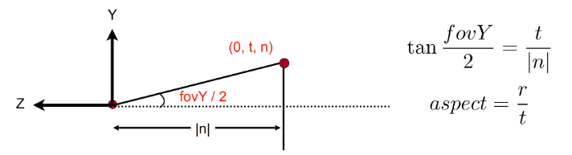
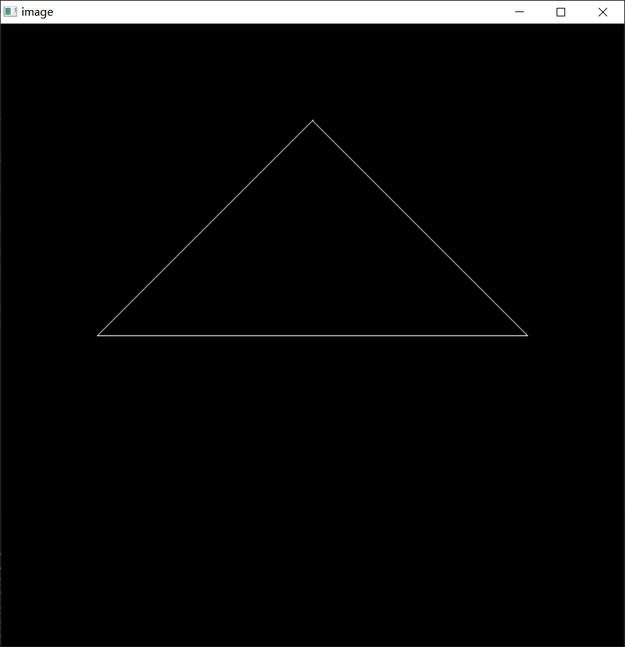

# 1 所需理论知识
## 变换
### 2D变换、3D变换
Scale
$$
S(s_x,s_y)=
\begin{pmatrix}
    s_x&0&0\\
    0&s_y&0\\
    0&0&1\\
\end{pmatrix}
$$
Rotation  
$$
R(\alpha)=\begin{pmatrix}
    cos\alpha&-sin\alpha&0\\
    sin\alpha&cos\alpha&0\\
    0&0&1\\
\end{pmatrix}
$$ 

Translation  
$$
T(t_x,t_y)=\begin{pmatrix}
    1&0&t_x\\
    0&1&t_y\\
    0&0&1\\
\end{pmatrix}
$$
### MVP变换、视口变换
model transformation  
- Find a good place and arrange people

view transformation  
- Find a good “angle” to put the camera 
  

  
$$T_{view} = \begin{pmatrix}
1&0&0&-x_e\\
0&1&0&-y_e\\
0&0&1&-z_e\\
0&0&0&1\\
\end{pmatrix}   
$$


- projection transformation  
3D to 2D  
正交投影  透视投影
- viewport transform
$$
M_{viewport}=\begin{pmatrix}
    \frac{width}{2}&0&0&\frac{width}{2}\\
    0&\frac{height}{2}&0&\frac{height}{2}\\
    0&0&1&0\\
    0&0&0&1\\
\end{pmatrix}  
$$
# 2 分析

需要完成`main.cpp`中两个函数中矩阵的返回
- 透视投影变换矩阵`get_projection_matrix`   
投影矩阵需要经过两步：
  - 透视投影->正交投影
  
$$
M_{persp->ortho}=\begin{bmatrix}
    n&0&0&0\\
    0&n&0&0\\
    0&0&n+f&-nf\\
    0&0&1&0\\
\end{bmatrix}  
$$  
代码如下  
```C++
    Eigen::Matrix4f Mpersp_orhtho;
    Mpersp_orhtho << n, 0, 0, 0,
        0, n, 0, 0,
        0, 0, n + f, -n*f,
        0, 0, 1, 0;
``` 
- 透视投影变换矩阵
  - 正交投影->正则立方体  

$$
M_{ortho}=\begin{bmatrix}
    \frac{2}{r-l}&0&0&0\\
    0&\frac{2}{t-b}&0&0\\
    0&0&\frac{2}{n-f}&0\\
    0&0&0&1\\
\end{bmatrix}\begin{bmatrix}
    1&0&0&-\frac{r+L}{2}\\
    0&1&0&-\frac{t+b}{2}\\
    0&0&1&-\frac{n+f}{2}\\
    0&0&0&1\\
\end{bmatrix}
$$  
将接口参数的视锥信息进行转换后，套入矩阵运算。  
代码如下：  
```C++
    float fovY = eye_fov / 180 * MY_PI;// 角度转弧度
    float t = tan(fovY / 2) * (-n), b = -t;// 朝向-z方向|n|
    float r = aspect_ratio * t, l = -r;
        Eigen::Matrix4f Mortho, Mtrans, Mscale;
    Mtrans << 1, 0, 0, -(r + l) / 2,
        0, 1, 0, -(t + b) / 2,
        0, 0, 1, -(n + f) / 2,
        0, 0, 0, 1;
    Mscale << 2 / (r - l), 0, 0, 0,
        0, 2 / (t - b), 0, 0,
        0, 0, 2 / (n - f), 0,
        0, 0, 0, 1;
    Mortho = Mscale * Mtrans;
```  
最后可以得到投影矩阵
```C++
    projection = Mortho * Mpersp_orhtho;
    return projection;
```
- 旋转变换矩阵 `get_model_matrix`  

绕z轴旋转矩阵  
Eigen默认弧度制，但框架中接口函数参数提供的角为角度值，所以要先转换为弧度制
$$
R_{z}(\alpha) = \begin{bmatrix}
cos\alpha&-sin\alpha&0&0\\
sin\alpha&cos\alpha&0&0\\
0&0&1&0\\
0&0&0&1\\
\end{bmatrix} 
$$  
代码如下
```C++
Eigen::Matrix4f get_model_matrix(float rotation_angle)
{
    Eigen::Matrix4f model = Eigen::Matrix4f::Identity();
    float a = rotation_angle / 180 * MY_PI;
    model << cos(a), -sin(a), 0, 0,
        sin(a), cos(a), 0, 0,
        0, 0, 1, 0,
        0, 0, 0, 1;

    return model;
}
```  
# 3 结果
补全代码后编译运行  
